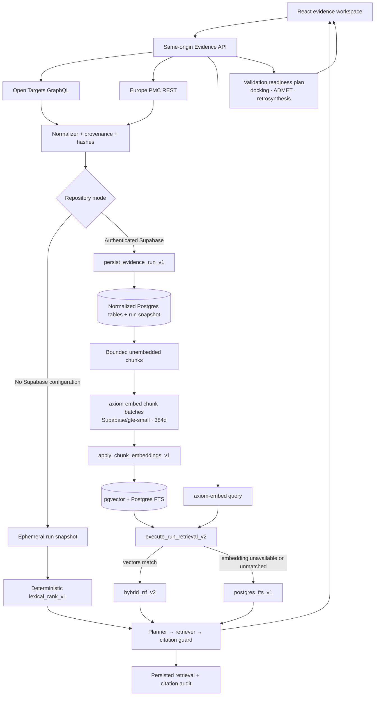
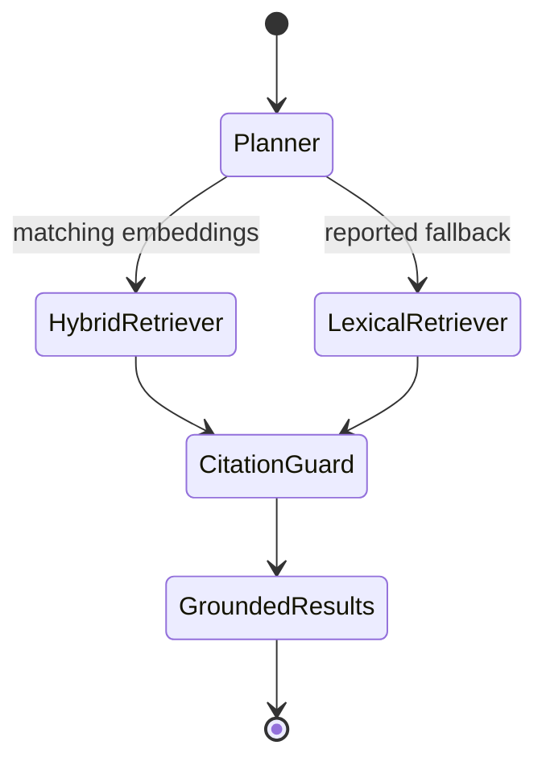

# Development architecture

## Product boundary

The system helps a researcher collect, index, retrieve, and inspect evidence. It must distinguish four different claims:

1. **Retrieved fact** — a source record returned by Open Targets or Europe PMC.
2. **Upstream score** — a source-defined ranking or evidence score, not calibrated confidence.
3. **Computational prediction** — a future model or docking-worker output with model, version, inputs, and uncertainty.
4. **Experimental validation** — an external laboratory result. The application cannot create this claim.

The current milestone implements the first two classes, retrieval infrastructure, and a readiness plan for future computational workers. Embedding similarity and reciprocal-rank-fusion values organize passages; they are not biological confidence, causal evidence, toxicity estimates, or experimental validation. The validation plan audits missing molecule/receptor inputs and worker configuration, but it does not execute docking, ADMET, toxicity, or retrosynthesis. Every retrieval response remains `generated: false`.

## Current hybrid RAG vertical

The Vite development middleware and production worker expose the same `/api/*` contract. Tests inject upstream, persistence, and embedding transports rather than changing production behavior.

## Evidence run lifecycle

A run is the unit of reproducibility. It contains:

- immutable target and disease identifiers;
- source-native association, evidence, and literature data;
- exact source endpoints, query descriptions, retrieval timestamps, licences when known, and source URLs;
- normalized record and chunk counts;
- embedding model, revision, dimensions, chunking configuration, and index status;
- explicit stage, capability, fallback, and warning states;
- validation readiness for future docking, ADMET/toxicity, and retrosynthesis workers;
- a versioned compatibility snapshot for API reads and export;
- no fabricated fallback values or generated scientific answer.

### 1. Acquire and normalize

The API acquires Open Targets and Europe PMC records, then builds a normalized payload. Evidence and literature become typed rows and source-linked documents. Document and chunk content receive SHA-256 hashes. The current chunker uses deterministic word windows of at most 220 words and 1,800 characters with a 32-word overlap.

In durable mode, `persist_evidence_run_v1(jsonb)` writes the run snapshot, normalized run, stages, association, sources, evidence records, literature records, documents, and chunks in one Postgres transaction. The security-definer RPC derives the caller and default workspace from the Supabase JWT; UUIDs supplied inside child records cannot select another workspace. A failed transaction does not silently fall back to process memory.

The normalized evidence transaction and embedding phase are intentionally separate. This makes source data durable before model inference and allows the bounded embedding phase to report failure without pretending that normalized ingestion failed. Derived row identities are stable per run, so immediate retries can safely resume existing ingestion; durable queued recovery across process failures remains outstanding.

### 2. Embed and index

The durable repository reads unembedded chunks for the run and rejects runs that exceed its 500-chunk safety cap. Chunks are sent in batches of at most six to the authenticated `axiom-embed` Supabase Edge Function. Inputs are bounded to 3–2,000 characters. Transient network, `429`, and selected `5xx` failures receive at most three immediate attempts with bounded backoff.

The function keeps a module-scoped `Supabase.ai.Session("gte-small")`, mean-pools and normalizes each vector, and returns the pinned application contract:

| Field | Current value |
| --- | --- |
| Model | `Supabase/gte-small` |
| Revision contract | `supabase-edge-runtime-managed` |
| Dimensions | `384` |
| Normalized | `true` |

The server validates the model name, revision, dimensions, finite values, requested IDs, and approximate normalization before writing a batch. The service-role-only `apply_chunk_embeddings_v1` enforces the exact model/revision contract, 384 dimensions, tight unit normalization, chunk identity, and completion checks inside Postgres. Embedding provenance is stored beside every vector; an authenticated workspace user cannot submit arbitrary vectors directly.

The revision label identifies the current Supabase-managed runtime contract; it is not an immutable upstream model commit. That limitation must be considered in model-drift and reproducibility work.

### 3. Retrieve and audit

For a durable query, the server attempts to embed the question with the same model contract and invokes `execute_run_retrieval_v2`. The RPC is scoped to one authorized run and:

1. builds an English Postgres web-search query and lexical ranks;
2. selects semantic candidates only from 384-dimensional chunks with the exact requested model and revision;
3. calculates inner-product vector similarity;
4. combines lexical and semantic ranks with reciprocal rank fusion using `rrf_k = 60`;
5. stores the retrieval and ranked results before returning them;
6. reports citation presence and explicit score semantics.

Candidate pools are bounded to at most `topK × 8` and 160 records. The current semantic ranking is intentionally exact after the run filter because each run is small. The schema also contains a partial HNSW vector index, but the current run-scoped RPC does not claim an approximate-nearest-neighbor scale advantage.

The response exposes the mode actually used:

| Mode | Meaning |
| --- | --- |
| `hybrid_rrf_v2` | Both Postgres FTS and matching pgvector embeddings participate in RRF |
| `postgres_fts_v1` | Durable normalized chunks are ranked lexically because no usable query/chunk embedding pair exists |
| `lexical_rank_v1` | Ephemeral in-memory snapshot is ranked by the deterministic JavaScript lexical baseline |

The lexical fallback is a first-class reported state, not a hidden substitution. Durable storage never falls back to memory. Query-embedding failure can fall back to authorized Postgres FTS because the normalized source data is still durable and visible to the same caller.

Lexical score, inner-product similarity, and fused RRF score are returned as ranking/similarity values and explicitly described as not confidence. The citation audit measures how many returned records have source identifiers. It does not establish source quality, claim entailment, causality, efficacy, binding, safety, or toxicity.

### 4. Agent workflow UI

The current “agentic” layer is an inspectable, bounded workflow rather than a free-form autonomous loop:

The API reports workflow step names and statuses. The UI renders Planner → hybrid/lexical retriever → Citation guard, the actual retrieval mode, embedding provenance, citation coverage, score breakdowns, source identifiers, and source links. If a field is absent, the UI reports it as unavailable instead of inferring success.

There is no synthesis step. The citation guard audits retrieved records; it does not write an answer, reason over mechanisms, or promote a conclusion.

## Persistence and authorization

The repository has two explicit modes:

- With complete server credentials, Supabase Postgres is authoritative. Durable routes require a validated Supabase session, idempotently provision a default workspace, and use the user's JWT for RLS- and RPC-scoped operations. Persistence failures return an error without memory fallback.
- With no Supabase configuration, process memory supports local UI development and is labeled ephemeral. It does not populate normalized Postgres tables or claim embeddings. The browser retains only the latest run ID and rehydrates the authoritative server record while it exists.
- Partial Supabase configuration is an error and fails closed.

The service-role credential remains server-only. User-owned ingestion and retrieval use it as the Supabase API key while the user's bearer token establishes `auth.uid()`. Vector mutation is a narrower service-role-only RPC. The Edge Function retains gateway JWT verification and also compares a server-only internal key before inference; neither credential enters the browser.

## Delivery gates

### Gate 1 — durable normalized evidence runs

Implemented in this milestone:

- versioned schema for workspaces, snapshots, normalized evidence, retrievals, jobs, artifacts, and events;
- browser Auth, server-side session validation, default workspace provisioning, RLS, and fail-closed persistence;
- transactional normalized ingestion with ownership checks, content hashes, conflict-safe upserts, and compatibility snapshots.

Still required for production:

- remote multi-user RLS and concurrency testing;
- upstream retry and cache policy for `429`, `502`, `503`, and `504`;
- structured logs, traces, latency/error metrics, recovery tooling, and provenance completeness alerts.

### Gate 2 — hybrid retrieval

Implemented in this milestone:

- bounded source-document chunking;
- authenticated 384-dimensional `Supabase/gte-small` Edge embeddings;
- model/revision provenance checks in the server and database;
- Postgres FTS plus pgvector similarity with run-scoped RRF;
- persisted retrieval records, citation audit, lexical fallback, and an inspectable workflow UI;
- no generated answer.

Still required before scientific reliance:

- a curated target–disease question set with relevance judgments;
- recall@k, MRR, duplicate rate, citation coverage, latency, and fallback-rate thresholds;
- benchmarking against biomedical embedding models and immutable revision pinning;
- licensed full-text ingestion policy, drift monitoring, retry/resume behavior, and optional reranker evaluation.

### Gate 3 — controlled synthesis agents

Not configured. A future synthesizer would need citation-bound claims, unsupported-claim rejection, identifier checks, causal-language controls, evaluation gates, and human approval. Retrieval success does not authorize generation.

### Gate 4 — asynchronous scientific workers

Implemented for local development:

- `/api/runs/:id/validation-plan`;
- Campaign tab with candidate ingestion, comparative ranking, six-job status, applicability/method boundaries, and human advance/hold/reject review;
- Supabase-backed campaigns, candidates, evaluations, reviews, idempotent jobs, service-role leasing, and completion RPCs;
- a local queue consumer launched by `npm run dev`;
- RDKit molecule preparation, ADMET-AI inference, Meeko docking preparation, and RDKit BRICS execution;
- structured capability states for docking, ADMET/toxicity, and retrosynthesis;
- explicit `simulationRun: false` and `generated: false` boundaries.

Capability-gated execution:

- Actual AutoDock Vina subprocess execution requires a registered binary and a prepared receptor under `services/receptors`; an optional known ligand provides a same-box score control, not RMSD redocking.
- Actual AiZynthFinder subprocess execution requires its binary, expansion/filter policies, stock snapshot, and `AXIOM_AIZYNTH_CONFIG`.
- Missing engines or inputs create durable `blocked` evaluations and contribute no invented score.

These future outputs remain computational predictions. Wet-lab or clinical validation is a separate evidence class and cannot be inferred from a successful job.

## Current limitations

- Indexable content is limited to normalized Open Targets records and Europe PMC metadata/abstracts; licensed full text is not ingested.
- The embedding model is a general retrieval baseline, not a validated biomedical reasoning or safety model.
- Retrieval is run-scoped; cross-run search, global corpus updates, reranking, answer generation, and claim-entailment validation are absent.
- Citation auditing validates identifier presence, not the correctness or scientific support of a claim.
- The 500-chunk safety cap and small sequential Edge batches are POC controls, not a high-throughput indexing architecture.
- Health currently probes Postgres, not the Edge embedding function; actual run/index and retrieval modes are the authoritative capability signal.
- Distributed worker scaling, heartbeat renewal, dead-letter operations, rate limits, operational dashboards, disaster recovery, and model-drift controls are not complete.
- Docking scoring and route search are executable adapters but unavailable on a machine that lacks Vina or AiZynthFinder configuration. Experimental validation and clinical translation remain outside the system.

The acceptance criteria and delivery sequence for controlled docking, model applicability domains, route planning, assay ingestion, reproducible campaign artifacts, and Phase I/II model-informed simulation are defined in [development-roadmap.md](development-roadmap.md).

## Security and governance gates

- Treat target names, abstracts, SMILES, files, queries, and retrieved text as untrusted input.
- Keep Edge Function JWT verification enabled and constrain outbound network destinations and tool permissions.
- Apply request/body limits, rate limits, run quotas, and workspace-aware operational controls.
- Store source and article licences; enforce full-text reuse policy before indexing.
- Retain raw source identifiers, checksums, model identity, revision, and source release metadata for reproducibility.
- Maintain model cards, validation datasets, drift checks, and rollback plans for every enabled model.
- Never expose hidden chain-of-thought; store concise workflow statuses, decision records, and tool traces instead.
