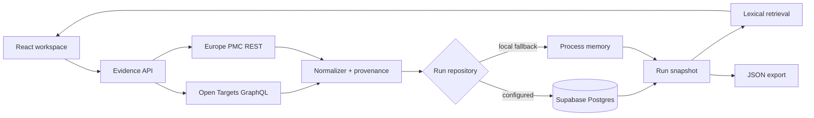
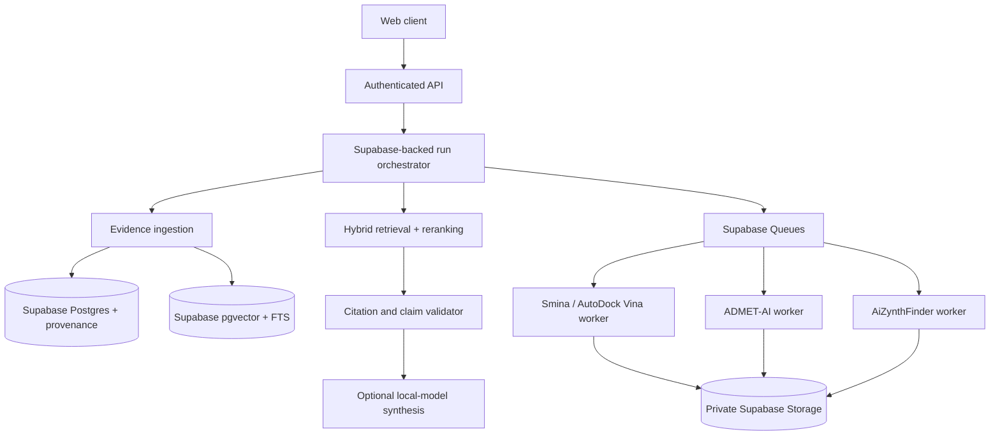

# Development architecture

## Product boundary

The system helps a researcher collect, retrieve, and inspect evidence. It must distinguish four different claims:

1. **Retrieved fact** — a source record returned by Open Targets or Europe PMC.
2. **Upstream score** — a source-defined ranking or evidence score, not calibrated confidence.
3. **Computational prediction** — a model or docking-worker output with model, version, inputs, and uncertainty.
4. **Experimental validation** — an external laboratory result. The application cannot create this claim.

Every UI and API response should preserve this boundary.

## Current vertical slice

The Vite development middleware and the production worker expose the same `/api/*` contract. Tests inject a mock upstream transport instead of changing application behavior.

### Run record

A run is the unit of reproducibility. It contains:

- immutable target and disease identifiers;
- normalized association, evidence, and literature records;
- exact source endpoints, query descriptions, and retrieval timestamps;
- explicit stage and capability states;
- warnings and schema version;
- no fabricated fallback values.

The repository runs in two explicit modes. With complete server credentials, Supabase Postgres is authoritative and persistence failures return `503` without silently falling back. Durable routes require a validated Supabase session, provision a default workspace, and use the user's JWT for RLS-scoped snapshot reads and writes. With no Supabase configuration, process memory supports local UI development and is labeled ephemeral. The browser retains only the latest run ID and rehydrates the authoritative server record.

### Retrieval

The first RAG slice is retrieval-only. It ranks normalized evidence and literature text with a deterministic lexical scorer and returns grounded passages. It intentionally produces no scientific answer.

This gives us a measurable baseline before introducing embeddings or a language model. Retrieval evaluation should use a small curated question set with source-level relevance labels, recall@k, MRR, duplicate rate, and citation coverage.

## Target production topology

The orchestrator should be a state machine, not a free-form autonomous loop. Each node receives a typed input, writes a typed artifact, records model/tool versions, and can be retried independently. LangGraph is an option for orchestration, not a requirement; plain durable jobs are preferable until branching behavior justifies it.

## Recommended delivery order

### Gate 1 — durable evidence runs

- **Implemented foundation:** versioned Supabase schema for workspaces, runs, source records, retrievals, jobs, artifacts, and audit events.
- **Implemented foundation:** repository adapter, fail-closed durable mode, compatibility snapshots, browser Auth/session UI, server-side token validation, default workspace propagation, RLS policies, idempotency constraints, and content hashes.
- **Remaining:** transactional writes into the normalized run/evidence tables, remote environment deployment, and live multi-user RLS integration tests.
- Upstream retry policy for `429`, `502`, `503`, and `504`; cache by query hash and source release.
- Structured logs, traces, latency/error metrics, and provenance completeness checks.

### Gate 2 — hybrid RAG

- Chunk abstracts/full text only where reuse permits.
- Local sentence-transformers or BGE embeddings.
- pgvector for the simplest operations footprint, or Qdrant when vector-specific filtering/scale warrants it.
- Lexical + dense candidate union, metadata filters, optional open reranker, and citation-bound context assembly.
- Evaluation gates before any generated answer is exposed.

### Gate 3 — controlled synthesis agents

- Planner selects only registered tools.
- Retriever supplies source-bounded context.
- Synthesizer emits claims with citations or marks them unsupported.
- Judge rejects missing citations, identifier drift, unsupported causal language, and score/confidence confusion.
- Human approval remains mandatory for any promoted scientific conclusion.

### Gate 4 — asynchronous scientific workers

- Docking: receptor/ligand preparation, Smina or AutoDock Vina execution, pose artifacts, box definition, seeds, logs, and redocking controls.
- ADMET: ADMET-AI model/version, SMILES standardization, applicability-domain flags, and prediction uncertainty.
- Retrosynthesis: AiZynthFinder configuration, stock database version, route score, and complete route artifacts.
- Isolated containers, resource limits, GPU scheduling where needed, checksum-addressed inputs, and cancel/retry semantics.

These outputs remain computational predictions. Wet-lab or clinical validation is a separate evidence class and cannot be inferred from a successful job.

## Security and governance gates

- Treat target names, abstracts, SMILES, files, and retrieved text as untrusted input.
- Constrain outbound network destinations and tool permissions per worker.
- Apply request/body limits, rate limits, and job quotas.
- Store source and article licences; enforce full-text reuse policy before indexing.
- Retain raw source identifiers and release/version metadata for reproducibility.
- Maintain model cards and validation datasets for every enabled predictor.
- Never expose hidden chain-of-thought; store concise decision records and tool traces instead.
